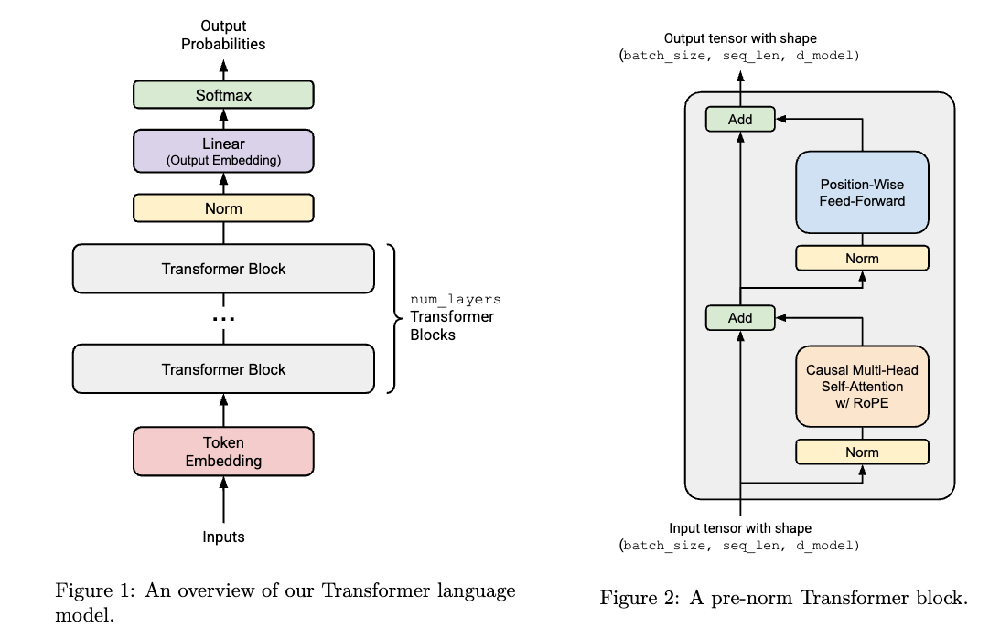

最近在学习 Standford 336 的课程，由于本人对这类计算问题不甚熟悉，因此记录一下。下图是课程中的 Transformer 结构：



## 问题一

考虑 GPT-2 XL，配置如下：

```
vocab_size : 50,257
context_length : 1,024
num_layers : 48
d_model : 1,600
num_heads : 25
d_ff : 6,400
```

假设我们使用这样的配置在上述结构中：

**1）模型中有多少可训练的参数？**

- Embedding

其参数的尺寸是 $num~embeddings\times embedding~dim$，所以

$$num~embeddings\times embedding~dim=vocab~size\times d~model=50,257\times 1,600=80,411,200$$

- RMSNorm

因为每个 TransformerBlock 中都有 RMSNorm、CausalMultiHeadAttention、RotaryPositionalEmbedding、SwiGLU，所以我们先讨论这三块。RMSNorm 的参数数量是 $d~model$，即

$$d~model=1,600$$

- RotaryPositionalEmbedding

虽然 RoPE 并没有需要训练的参数，但其在计算时也会占用内存，且大小为

$$seq~len \times \frac{d_k}{2} \times 2$$

其中 $d_k=d_v=d~model/num~heads=64$，故 RoPE 的（最大）参数量为：

$$seq~len \times \frac{d_k}{2} \times 2=context~length\times\frac{d_k}{2}\times 2=65,536$$

- SwiGLU

```python
class SwiGLU(torch.nn.Module):
    def __init__(self, d_model: int, d_ff: int = None, device=None, dtype=None):
        super().__init__()
        if d_ff is None:
            d_ff = 8 * d_model / 3
        self.w1 = Linear(d_model, d_ff, device, dtype)
        self.w2 = Linear(d_ff, d_model, device, dtype)
        self.w3 = Linear(d_model, d_ff, device, dtype)

    def forward(self, x: torch.Tensor):  # [batch_size, seq_len, d_model] -> [batch_size, seq_len, d_model]
        _x = self.w1(x)
        x_silu = _x * torch.sigmoid(_x)
        return self.w2(self.w3(x) * x_silu)
```

容易看出，总参数量为：

$$3\times d~model\times d~ff = 3 \times 1,600 \times 6,400=30,720,000$$

- CausalMultiHeadAttention

其 $Q、K、V、O$ 均为 $d~model\times d~model$，其中 $O$ 是上投影层。总共可训练参数量为：

$$4\times d~model\times d~model=4\times 1,600\times 1,600=10,240,000$$

- Transformer

每个 TransformerBlock 包含 2 个 RMSNorm，1 个 CausalMultiHeadAttention，1 个 SwiGLU。故总参数量为：

$$2\times1,600+10,240,000+30,720,000=40,963,200$$

Transformer 包括 1 个 Embedding、1 个 RotaryPositionalEmbedding（不计入可训练参数）、48 个 TransformerBlock、1 个 RMSNorm、1 个 Linear 上投影层（$d~model\times vocab~size$）。故总参数量为：

$$
1\times 80,411,200 + 48\times 40,963,200 + 1\times 1,600 + 1\times 1,600\times 50,257=2,127,057,600
$$

**2）假设每个参数都是单精度浮点数，载入这个模型需要多少内存？**

每个单精度浮点数占 4 字节，故总内存为：

$$
4\times 2,127,057,600=8,508,230,400~bytes \approx 7.9239~GB
$$

## 问题二

**1）假设输入的长度为 $context~length$，在一次前向传播过程中，需要多少 FLOPs？只计算矩阵乘法。**

对于矩阵 $A(m\times n)$、$B(n\times p)$，其 FLOPs 数量为 $2mnp$。知道做了多少次矩阵乘法，就知道了总的 FLOPs。我们还是像刚才一样，一层层看。

- Embedding

这里只是通过 token id 来选择对应的词向量，没有做矩阵乘法。

- RMSNorm（没有矩阵乘法，计算只是为了看一下量级）

其前向过程如下；

```python
def forward(
    self, x: torch.Tensor
) -> torch.Tensor:  # [batch_size, seq_len, d_model] -> [batch_size, seq_len, d_model]
    in_dtype = x.dtype
    x = x.to(torch.float32)

    rms = torch.sqrt(reduce(x**2, "... d_model -> ... 1", "mean") + self.eps)
    result = self.w * x / rms

    return result.to(in_dtype)
```

可以看到，实际上没有做矩阵乘法（注意 `self.w * x` 不是矩阵乘法）。

对于 `rms = torch.sqrt(reduce(x**2, "... d_model -> ... 1", "mean") + self.eps)` 来说，做了 $batch~size\times seq~len\times d~model$ 次乘法、$batch~size\times seq~len\times (d~model-1)+1$ 次加法、$batch~size\times seq~len$ 次开方。

对于 `result = self.w * x / rms` 来说，`self.w` 会被广播为 $batch~size\times seq~len\times d~model$，然后逐元素相乘，因此乘法次数也是 $batch~size\times seq~len\times d~model$，除法次数也是 $batch~size\times seq~len\times d~model$。

总共的运算次数是：

$$
\begin{aligned}
FLOPS_{RMSNorm} =& batch~size\times seq~len\times d~model + \\
& batch~size\times seq~len\times (d~model-1)+ 1 + \\
& batch~size\times seq~len + \\
& 2\times batch~size\times seq~len\times d~model \\
=&4\times batch~size\times seq~len\times d~model + 1
\end{aligned}
$$

- RotaryPositionalEmbedding（没有矩阵乘法，计算只是为了看一下量级）

其前向过程如下；

```python
def forward(
    self, x: torch.Tensor, token_positions: torch.Tensor
) -> torch.Tensor:  # ([..., seq_len, d_k], [..., seq_len]) -> [..., seq_len, d_k]
    pos_sin = self.sin[token_positions]  # [..., seq_len, d_k/2]
    pos_cos = self.cos[token_positions]  # [..., seq_len, d_k/2]

    x_even = x[..., 0::2]  # [..., seq_len, d_k/2]
    x_old = x[..., 1::2]  # [..., seq_len, d_k/2]

    x_even_rot = x_even * pos_cos - x_old * pos_sin  # [..., seq_len, d_k/2]
    x_old_rot = x_even * pos_sin + x_old * pos_cos  # [..., seq_len, d_k/2]

    x_rot = rearrange([x_even_rot, x_old_rot], "two ... -> ... two")
    x_rot = rearrange(x_rot, "... d1 d2 -> ... (d1 d2)")

    return x_rot
```

只有此处有浮点数运算：

```python
x_even_rot = x_even * pos_cos - x_old * pos_sin  # [..., seq_len, d_k/2]
x_old_rot = x_even * pos_sin + x_old * pos_cos  # [..., seq_len, d_k/2]
```

而 $d_k = d~model / num~heads = 64$，因此

$$
\begin{aligned}
FLOPS_{RotaryPositionalEmbedding} &= (2*batch~size\times seq~len\times d_k/2 + 1)\times 2 \\
&= 128\times batch~size\times seq~len + 2
\end{aligned}
$$

- SwiGLU（有矩阵乘法，为了得到答案，只计算矩阵乘法部分）

```python
def forward(self, x: torch.Tensor):  # [batch_size, seq_len, d_model] -> [batch_size, seq_len, d_model]
    _x = self.w1(x)
    x_silu = _x * torch.sigmoid(_x)
    return self.w2(self.w3(x) * x_silu)
```

第一次矩阵乘法，`_x = self.w1(x)`， FLOPs 数量为：

$$
batch~size\times 2\times seq~len\times d~model\times d~ff
$$

第二次矩阵乘法，`self.w3(x)`， FLOPs 数量为：

$$
batch~size\times 2\times seq~len\times d~model\times d~ff
$$

第三次矩阵乘法，`self.w2(self.w3(x) * x_silu)`， FLOPs 数量为：

$$
batch~size\times 2\times seq~len\times d~model\times d~ff
$$

其中，$d~ff=\frac{8d~model}{3}$，故 SwiGLU 总 FLOPs 数量为：

$$
batch~size\times 16\times seq~len\times d~model\times d~model
$$

- scaled_dot_product_attention（有矩阵乘法，为了得到答案，只计算矩阵乘法部分）

```python
def scaled_dot_product_attention(
    Q: torch.Tensor,  # (batch_size, ..., seq_len, d_k)
    K: torch.Tensor,  # (batch_size, ..., seq_len, d_k)
    V: torch.Tensor,  # (batch_size, ..., seq_len, d_v)
    mask: torch.Tensor | None = None,  # (seq_len, seq_len)
) -> torch.Tensor:  # (batch_size, ..., d_v)
    d_k = Q.shape[-1]
    score_attention = einsum(Q, K, "... seq_len_q d_k, ... seq_len_k d_k -> ... seq_len_q seq_len_k") / math.sqrt(d_k)
    if mask is not None:
        score_attention = torch.where(mask, score_attention, float("-inf"))
    score_attention = softmax(score_attention, dim=-1)  # [... seq_len_q seq_len_k]
    return einsum(score_attention, V, "... seq_len_q seq_len_k, ... seq_len_k d_v -> ... seq_len_q d_v")
```

$Q$ 和 $K$ 矩阵乘法，FLOPs 数量为：

$$
batch~size\times 2 \times seq~len\times d_k\times seq~len
$$

再乘 $V$ 矩阵，FLOPs 数量为：

$$
batch~size\times 2 \times seq~len\times seq~len\times d_v
$$

其中，$d_k=d_v=d~model/num~heads=64$，故 scaled_dot_product_attention 总 FLOPs 数量为：

$$
\begin{aligned}
FLOPS_{scaled~dot~product~attention}&= batch~size\times 4 \times seq~len\times seq~len\times 64 \\
&= 128\times batch~size\times seq~len\times seq~len
\end{aligned}
$$

- CausalMultiHeadAttention（有矩阵乘法，为了得到答案，只计算矩阵乘法部分）

```python
def forward(self, x: torch.Tensor) -> torch.Tensor:  # [batch_size, seq_len, d_model]
    q = self.w_q(x)
    k = self.w_k(x)
    v = self.w_v(x)

    q = rearrange(
        q, "batch_size seq_len (num_heads d_k) -> batch_size num_heads seq_len d_k", num_heads=self.num_heads
    )
    k = rearrange(
        k, "batch_size seq_len (num_heads d_k) -> batch_size num_heads seq_len d_k", num_heads=self.num_heads
    )
    v = rearrange(
        v, "batch_size seq_len (num_heads d_v) -> batch_size num_heads seq_len d_v", num_heads=self.num_heads
    )

    if self.token_positions is None:
        self.token_positions = torch.arange(x.shape[-2], device=x.device)
    if self.rope is not None:
        q = self.rope(q, self.token_positions)
        k = self.rope(k, self.token_positions)

    mask = ~torch.triu(torch.ones((x.shape[-2], x.shape[-2]), device=x.device, dtype=torch.bool), diagonal=1)

    y = scaled_dot_product_attention(q, k, v, mask)
    y = rearrange(y, "batch_size num_heads seq_len d_v -> batch_size seq_len (num_heads d_v)")
    y = self.w_o(y)
    return y
```

其 $Q、K、V、O$ 均为 $d~model\times d~model$，其中 $O$ 是上投影层。四个矩阵乘法形状相同，总计算量为：

$$
4\times batch~size\times 2\times seq~len\times d~model \times d~model
$$

而 $FLOPS_{scaled~dot~product~attention}=128\times batch~size\times seq~len\times seq~len$，所以

$$
\begin{aligned}
FLOPS_{CausalMultiHeadAttention}=&4\times batch~size\times 2\times seq~len\times d~model \times d~model + \\
&128\times batch~size\times seq~len\times seq~len \\
=& 8\times batch~size \times seq~len \times d~model^2 + 128 \times batch~size\times seq~len^2
\end{aligned}
$$

- TransformerBlock（有矩阵乘法，为了得到答案，只计算矩阵乘法部分）

```python
def forward(self, x: torch.Tensor) -> torch.Tensor:
    y = x + self.attn(self.norm1(x))
    y = y + self.ff(self.norm2(y))
    return y
```

所以

$$
FLOPS_{TransformerBlock}= FLOPS_{CausalMultiHeadAttention} + FLOPS_{SwiGLU}
$$

- TransformerLM（有矩阵乘法，为了得到答案，只计算矩阵乘法部分）

```python
def forward(self, x: torch.Tensor):  # [batch_size, seq_len]
    assert x.shape[-2] < self.context_length, "Input sequence length is longer than the context length"
    y = self.embedding(x)  # [batch_size, seq_len, d_model]
    for transformer_block in self.transformer_blocks:  # [batch_size, seq_len, d_model]
        y = transformer_block(y)
    y = self.norm(y)  # [batch_size, seq_len, d_model]
    y = self.linear(y)  # [batch_size, seq_len, vocab_size]
    return y
```

所以

$$
\begin{aligned}
FLOPS_{TransformerLM} =& num~layers\times FLOPS_{TransformerBlock} + FLOPS_{RMSNorm} + FLOPS_{Linear}\\
=& num~layers\times (FLOPS_{CausalMultiHeadAttention} + FLOPS_{SwiGLU}) + FLOPS_{RMSNorm} + FLOPS_{Linear}\\
=& 48\times(8\times batch~size \times 1024\times 1600^2+128\times batch~size\times 1024^2+batch~size\times 16\times 1024\times 1600^2)+\\
&0+\\
&2\times batch~size\times 1024\times 50257\times 1600 \\
=&1,177,881,214,976\times batch~size
\end{aligned}
$$

## 问题三

**1）哪部分 FLOPs 最多？**

是 $FLOPS_{SwiGLU}$。其次是 $FLOPS_{CausalMultiHeadAttention}$。

## 问题四

1）对于 GPT-2 small (12 layers, 768 d_model, 12 heads)、 GPT-2 medium (24layers, 1024 d_model, 16 heads) 和 GPT-2 large (36 layers, 1280 d_model, 20 heads) 模型，哪个变量的改变最影响模型的 FLOPs 数量？

根据计算公式，很显然应该是平方项，即 $d~model$ 和 $context~length$。不过这里没有 $context~length$，所以答案应该是 $d~model$。

## 问题五

1）GPT-2 XL 把上下文窗口增加到 16,384，总共的 FLOPs 如何变化？

重新算一遍就完事了，懒得算了。不过根据上一题的分析，上下文窗口会导致 FLOPs 猛增。