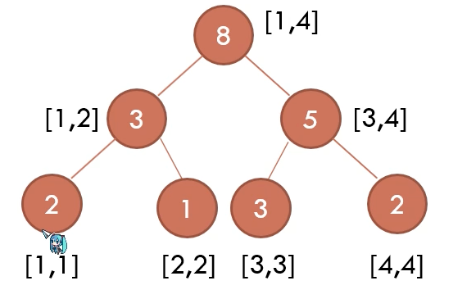

## 常用技巧

### 离散化

```c++
#include <algorithm>
using namespace std;

vector<int> v;
inline int get_id(int x){
    return lower_bound(v.begin(), v.end(), x) - v.begin() + 1; // 下标从 1 开始
}
int main(){
    for(int i=1; i<=n; i++){
        cin>>a[i];
        v.push_back(a[i]);
    }
    sort(v.begin(), v.end());
    v.erase(unique(v.begin(), v.end()), v.end());
}
```

## 数据结构

### 线段树

#### 朴素线段树

```c++
#include <bits/stdc++.h>
#define int long long
using namespace std;

const int N=200010;
int m, p;

struct Node{
    int l, r;
    int v;
}tr[N*4]; // 一般设置为最大量的 4 倍

// 借助子节点，更新父节点
void pushup(int u){
    tr[u].v = max(tr[u<<1].v, tr[u<<1|1].v);
}

// 构建节点 u，需要维护的区间为 [l, r]
void build(int u, int l, int r){
    tr[u] = {l, r};
    if(l == r) return;
    int mid = l+r>>1;
    build(u<<1, l, mid), build(u<<1|1, mid+1, r);
}

// 从 u 节点查询区间 [l, r] 的某个信息
int query(int u, int l, int r){
    if(tr[u].l >= l && tr[u].r <= r) return tr[u].v;
    int mid = tr[u].l + tr[u].r >> 1;
    int ans=0;
    if(l<=mid) ans = query(u<<1, l, r);
    if(r>mid) ans = max(ans, query(u<<1|1, l, r));
    return ans;
}

// 从 u 节点递归查找，把编号为 x 的节点的值修改为 v
void modify(int u, int x, int v){ 
    if(tr[u].l == x && tr[u].r == x) tr[u].v = v;
    else{
        int mid = tr[u].l + tr[u].r >> 1;
        if(x <= mid) modify(u<<1, x, v);
        else modify(u<<1|1, x, v);
        pushup(u);
    }
}

void solve(){
    int n, last, m, p;
    cin>>m>>p;

    build(1, 1, m);

    char op;
    int x;
    while(m--){
        cin>>op>>x;
        if(op == 'Q'){
            last = query(1, n-x+1, n);
            cout<<last<<endl;
        }else{
            modify(1, n+1, (last+x)%p);
            ++n;
        }
    }
}

signed main(){
    ios::sync_with_stdio;
    cin.tie(0),cout.tie(0);
    
    int t=1;
    // cin<<t;
    while(t--) solve();
    return 0;
}
```

#### 权值线段树

在值域 [l, r] 上对值的个数进行维护的线段树。如下图，是序列 1, 1, 2, 3, 3, 3, 4, 4 的权值线段树：



#### 可持久化线段树

    可持久化数据结构总是可以保留每一个历史版本，并且支持操作的不可变特性。

核心思想：对区间进行单点修改后，只将其影响到的父节点复制出来（如下图的 v1 版本），以节省存储空间。


#### 主席树

```c++
#include <bits/stdc++.h>
#define int long long
using namespace std;

const int N = 2e5+5;

int a[N];

vector<int> v;

inline int get_id(int x){ return lower_bound(v.begin(), v.end(), x) - v.begin() + 1; }

struct Node{
    int l, r, sum;
}tr[N*40];

int cnt, root[N];

void insert(int l ,int r, int pre, int &now, int p){
    tr[++cnt]=tr[pre];
    now = cnt;
    tr[now].sum++;
    if(l==r) return;
    int m = l+r>>1;
    if(p<=m) insert(l, m, tr[pre].l, tr[now].l, p);
    else insert(m+1, r, tr[pre].r, tr[now].r, p);
}

int query(int l, int r, int L, int R, int k){
    if(l==r) return l;
    int m=l+r>>1;
    int tmp=tr[tr[R].l].sum - tr[tr[L].l].sum;
    if(k<=tmp) return query(l, m, tr[L].l, tr[R].l, k);
    else return query(m+1, r, tr[L].r, tr[R].r, k-tmp);
}

void solve(){
    int n, m;cin>>n>>m;

    for(int i=1;i<=n;++i){
        cin>>a[i];
        v.push_back(a[i]);
    }

    sort(v.begin(), v.end());
    v.erase(unique(v.begin(), v.end()), v.end());

    for(int i=1;i<=n;++i) insert(1, n, root[i-1], root[i], get_id(a[i]));
    while(m--){
        int l, r, k;cin>>l>>r>>k;
        cout<<v[query(1, n, root[l-1], root[r], k)-1]<<endl;
    }
}

signed main(){
    ios::sync_with_stdio;
    cin.tie(0),cout.tie(0);
    
    int t=1;
    // cin>>t;
    while(t--) solve();
    return 0;
}
```